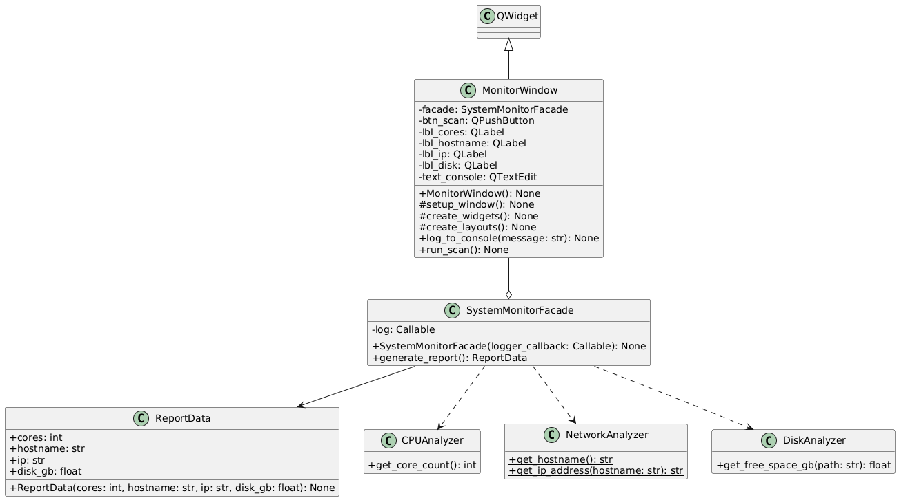

# Moniteur Système — Pattern Façade

Application de monitoring système développée en Python avec PyQt6, illustrant l'implémentation du **Design Pattern Façade**.

L'objectif est de montrer comment masquer la complexité d'un sous-système (plusieurs analyseurs indépendants) derrière un point d'entrée unique, tout en gardant l'interface graphique totalement découplée de la logique métier.



---

## Fonctionnalités

- Nombre de cœurs du processeur
- Nom d'hôte et adresse IP de la machine
- Espace disque libre sur le disque principal
- Journal d'activité en temps réel pendant l'analyse

---

## Architecture

```
Façade/
├── main.py                        # Point d'entrée — lance l'application PyQt6
├── monitor_window.py              # Interface graphique (Client)
└── core/
    ├── system_monitor_facade.py   # Façade — point d'entrée unique du sous-système
    ├── cpu_analyzer.py            # Analyseur CPU
    ├── network_analyzer.py        # Analyseur réseau
    ├── disk_analyzer.py           # Analyseur disque
    └── report_data.py             # Dataclass structurant les résultats
```

### Client (`main.py` & `monitor_window.py`)

Gère uniquement l'affichage et les interactions utilisateur. L'interface présente trois cartes (Processeur, Réseau, Stockage) ainsi qu'une console de journal. Le client ne connaît qu'une seule classe du sous-système : `SystemMonitorFacade`.

### Façade (`core/system_monitor_facade.py`)

Orchestre les appels aux trois analyseurs, remonte les messages de progression au client via un callback, et retourne un objet `ReportData` contenant l'ensemble des données collectées.

### Sous-système (`core/`)

| Fichier | Rôle |
|---|---|
| `cpu_analyzer.py` | Récupère le nombre de cœurs via `os.cpu_count()` |
| `network_analyzer.py` | Récupère le nom d'hôte et l'IP via le module `socket` |
| `disk_analyzer.py` | Calcule l'espace libre en Go via `shutil.disk_usage()` |
| `report_data.py` | Dataclass `ReportData` regroupant les résultats |

---

## Prérequis

- Python 3.x
- PyQt6 (seule dépendance externe — les autres modules utilisés sont inclus dans la bibliothèque standard)

```bash
pip install PyQt6
```

---

## Lancement

```bash
python main.py
```
